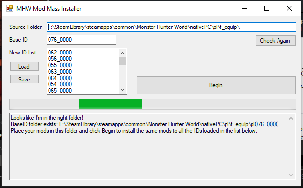

# MHWArmorTool
Simple tool to use the same mods on all armor in the game.

Place the compiled release (or compile it yourself) in your nativePC folder, run it, and tell it which folder contains the mods you want to apply to all the armor ID sets.

By default it will use `\pl\f_equip\pl076_0000` and copy everything from this folder to the ID List like so: `\pl\f_equip\pl###_####`

Click Begin and it will copy that folder to all the armor IDs.

You can use the default list which should include everything up to Safi, or you can specify only a few. One ID per line. Save/Load the list as you please, and if a saved list is found it will be loaded at startup.

## Screenshot

